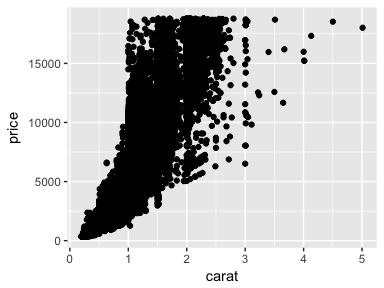
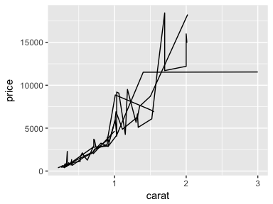
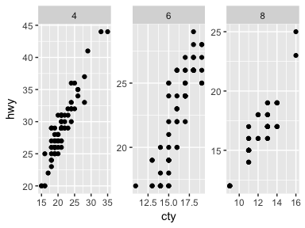
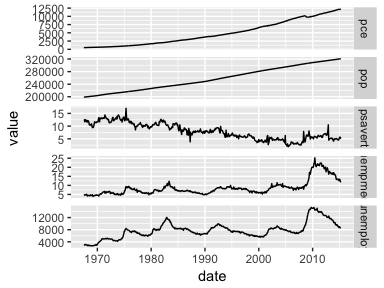

ggplot2 tutorial
================
Fan Gong
2017/6/29

ggplot2
=======

Start from `qplot`
------------------

`qplot` means quick plot. Its syntax is pretty similar to `plot` function.

``` r
library(ggplot2)
library(reshape2)
dsmall = diamonds[sample(nrow(diamonds), 100),]
qplot(carat, price, data = diamonds)
```



### color, size and shape

`qplot` has a different way to understand color and size, we do not need to specify the color or shape, `qplot` could automatically finish.

``` r
qplot(carat, price, data = dsmall, colour = color)
```


``` r
qplot(carat, price, data = dsmall, shape = cut)
```


``` r
qplot(carat, price, data = dsmall, alpha = (1/10))
```


### geometric object

use `geom =` to change geometric object in `qplot`.

| geometric object | fomular              |
|------------------|----------------------|
| scatter plot     | `geom = "point"`     |
| line plot        | `geom = "smooth"`    |
| box plot         | `geom = "boxplot"`   |
| histogram        | `geom = "histogram"` |

``` r
qplot(carat, price, data = dsmall, geom = c("point", "smooth"))
```


``` r
#choose different method and formula
qplot(carat, price, data = dsmall, geom = c("point", "smooth"), method = "lm", formula = y~poly(x,2))
```


``` r
#boxplot
##the first variable here is a factor
qplot(color, price, data = dsmall, geom = "boxplot")
```


``` r
#histgram and density
qplot(carat, data = dsmall, geom = "histogram", binwidth = 0.1)
```


`ggplot2`
---------

### Data + Aesthetic mappings

`aes()` function is used to map data into plot. The `aes` function takes a list of aesthetic-variable pairs like this : `aes(x = weight, y = height, colour = age)`

``` r
#setting
##This means we set the colour of all data points to be dark blue.
ggplot(data = dsmall, aes(x = carat, y = price))+
  geom_point(colour = "darkblue")
```


``` r
#mapping
##This means we deem "darkblue" as one class thing and make it the first color which is red. 
ggplot(data = dsmall, aes(x = carat, y = price))+
  geom_point(aes(colour = "darkblue"))
```


``` r
#grouping
ggplot(data = dsmall, aes(x = carat, y = price))+
  geom_line(aes(group = cut))
```



### stat

stat is a statistical transformarion. A `stat` takes a dataset as input and returns a dataset as output, and so a stata can add new variables to the original dataset.

``` r
d = ggplot(diamonds, aes(carat)) + xlim(0,3)
d + stat_bin(aes(y = ..count..), binwidth = 0.1, geom = "area")
```


``` r
d + stat_bin(aes(size = ..density..), binwidth = 0.1, geom = "point", position = "identity")
```


### position

Position adjustments apply minor tweaks to the position of elements within a layer.

``` r
#No position, default is position = stack
ggplot(dsmall, aes(carat)) +
  geom_histogram(aes(colour = cut), binwidth = 0.1)
```


``` r
ggplot(dsmall, aes(carat)) +
  stat_bin(aes(y = ..count.., colour = cut), binwidth = 0.1)
```


``` r
#Have position
ggplot(dsmall, aes(carat)) +
  geom_histogram(aes(colour = cut), binwidth = 0.1, stat = "bin", position = "dodge")
```


### Scales, axes and legends

To add a different scale or to modify some features of the default scale, you must construct a new scale and then add it to the plot using +. All scale constructors have a common naming scheme. They start with `scale_`, followed by the name of the aesthetic(e.g., `colour_`, `shape_` or `x_`), and finally by the name of the scale(e.g., `gradient`, `hue` or `manual`)

``` r
#The default scale
p = ggplot(aes(x = sleep_total, y = sleep_cycle, colour = vore), data = msleep) + geom_point()
p
```


``` r
#Change the appearance of the legend
p + scale_color_hue("what does\nit eat?", breaks = c("herbi", "carni", "omni", NA), labels = c("plants", "meat", "both", "don't know"))
```


``` r
#Use a different scale
p + scale_color_brewer(palette = "Set1")
```


#### Common Arguments

The following arguments are common to all scales \* `name`: sets the label which will appear on the axis or legend.

-   `limits`: fixes the domain of the scale. Limits are useful for removing data you don't want diplayed.

-   `breaks` and `labels`: `breaks` controls which values appear on the axis or legend, i.e, what values tick marks should appear on an axis or how a continuous scale is segmented in a legend. `labels` specifies the labels that should appear at the breakpoints. If `labels` is set, you must also specify `breaks`, so that the two can be matched up correctly.

The difference between `breaks` and `limits` is that breaks affect what appears on the axes and legends, while limits affect what appears on the plot.

``` r
p = ggplot(data = mpg, aes(x = cty, y = hwy, colour = displ)) + geom_point()
p
```


``` r
#Set the names
p + labs(x = expression(frac(miles, gallon)), y = "Highway", colour = "Displacement")
```


``` r
#Set the breaks and labels
p + scale_x_continuous(breaks = c(15,25), labels = c("a","b")) +scale_y_continuous(breaks = c(20,30,40), labels = c("20_y","30_y","40_y") )
```


``` r
#Set the limits
p + scale_x_continuous(limits = c(15,25))
```

 \#\#\#\#Color Color has three components: hue, chroma, luminance.

For Continuous data, there are three types of color gradients:

1.  `scale_color_gradient(low = , high = )`

2.  `scale_color_gradient2(low = , high = , midpoint =)`

3.  `scale_color_gradientn()`

For discrete data, there are three color scales, one chooses automatically, another makes it easy to select from hand-picked sets.

1.  `scale_color_hue()`, which picks evenly spaced hurs around the hcl color wheels

2.  `scale_color_brewer()` uses the ColorBrewer colors, Use `RColorBrewer::display.brewer.all` to list all palettes.

3.  `scale_color_manual(values = c("red"))` make our own color

``` r
#CONTINUOUS
q = ggplot(data = mpg, aes(x = cty, y = hwy, fill = displ)) + geom_tile()
q
```


``` r
##pay attention the 'limits' works on which variable, since here we use 'scale_fill' and 'fill = diple', so 'limits' works on displ.
q+scale_x_continuous(expand = c(0,0))+scale_y_continuous(expand = c(0,0))+scale_fill_gradient(limits = c(2,3), low = "white", high = "red")
```


``` r
#DISCRETE
point = qplot(data = msleep,x = brainwt, y= bodywt, log = "xy", colour = vore)
point
```


``` r
point + scale_color_brewer(palette = "Set2")
```


``` r
area = qplot(log10(brainwt), data = msleep, fill = vore, binwidth = 1)
area
```


``` r
area + scale_fill_brewer(palette = "Pastel1")
```


``` r
#Pay attention that the number of color you set should match to the number of level of "displ"

point + scale_color_manual(values = c("red","orange","yellow","green","blue"))
```


``` r
point +aes(shape = vore) +scale_shape_manual(values = c(1,2,6,0,23))
```


### Faceting

There are two types of faceting provided by `ggplot2: facte_grid` and `facet_wrap`

#### Facet Grid

`face_grid` produce a 2d grid of panels difined by variables which form the rows and columns.

``` r
mpg2 = subset(mpg, cyl != 5 & drv %in% c("4", "f"))

#A single row with multiple columns.
qplot(cty, hwy, data = mpg2) + facet_grid(.~cyl)
```


``` r
#A single column with multiple rows.
qplot(cty, data = mpg2, geom = "histogram", binwidth = 2) +facet_grid(cyl~.)
```


``` r
#multiple rows and columns.
qplot(cty, hwy, data = mpg2) + facet_grid(drv~cyl)
```


``` r
#facet with margin(total over a row or column)
qplot(cty, hwy, data = mpg2) + 
  geom_smooth(method = "lm", se = F) +
  facet_grid(drv ~ cyl, margins = T)
```


#### Facet Wrap

`facet_wrap` produces a 1d ribbon of panels that is wrapped into 2d.

``` r
qplot(cty, data = mpg2, geom = "histogram", binwidth = 2) +
  facet_wrap(c("cyl","drv"), ncol = 2)
```


#### Controlling scales

For both types of faceting you can control whether the position scales are the same in all panels or allowed to vary between panels. This is controlled by the `scales` parameter:

-   `scales = "fixed"`: x and y scales are fixed across all panels.

-   `scales = "free"`: x and y scales vary across all panels.

-   `scales = "free_x"`: the x scale is free, and the y scale is fixed.

-   `scales = "free_y"`: the y scale is free, and the x scale is fixed.

There is an additional constraint on the scales of `fecet_grid`: all panels in a column must have the same x scale, and all panels in a row must have the same y scale. This is because each column shares an x axis, and each row shares a y axis.

``` r
#example of free scales
p = qplot(cty, hwy, data = mpg2)
p + facet_wrap(~cyl, scales = "free")
```



``` r
#example of fixed scales
em = melt(economics, id = "date")
ggplot(data = em, aes(x = date, y = value)) +
  geom_line(aes(group = variable))+
  facet_grid(variable~., scales = "free_y")
```



``` r
ggplot(data = em, aes(x = date, y = value)) +
  geom_line(aes(group = variable))+
  facet_wrap(~variable, scales = "free_y")
```


