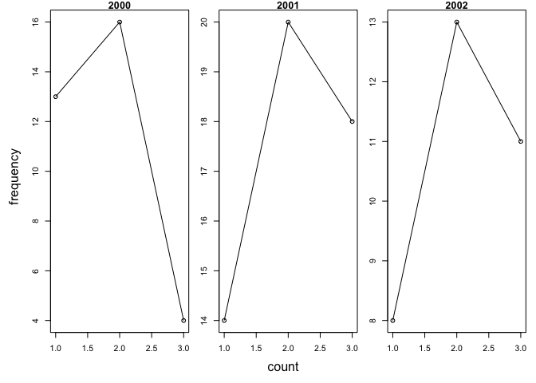

plyr tutorial
================
Fan Gong
2017/6/27

plyr tutorial
=============

`plyr` is a data manipulating package which is especially for split-apply-combine. In general, `plyr` is a set of tools that solves a common set of problems: you need to break a big problem down into manageable pieces, operate on each piece and then put all the pieces back together.

`plyr` builds on the build-in `apply` functions by giving you control over the input and output formats and keeping the syntax consistent across all variations.

The basic format is two letters followed by `ply()`. The first letter refers to the format in and the second to the format out.

The three main letters are:

1.  `d` = data frame

2.  `a` = array(include matrics)

3.  `l` = list

There are also some less common format options, here I will only talk about `_`, which means it throw away the output.

split-apply-combine with plyr
-----------------------------

### ddply

``` r
library(plyr)
df = data.frame(year = rep(2000:2002, each = 3), count = round(runif(9, 0, 20)))
head(df)
```

    ##   year count
    ## 1 2000    13
    ## 2 2000    16
    ## 3 2000     4
    ## 4 2001    14
    ## 5 2001    20
    ## 6 2001    18

``` r
#use ddply to calculate CV for every year
ddply(df, "year", function(x){
  mean = mean(x$count)
  sd = sd(x$count)
  cv = sd/mean
  return(data.frame(cv.count = cv))
})
```

    ##   year  cv.count
    ## 1 2000 0.5677271
    ## 2 2001 0.1762529
    ## 3 2002 0.2359323

### ldply

``` r
#use ldply to calculate CV in every piece
df2 = data.frame(year = rep(2003:2005, each = 3), count = round(runif(9, 32, 50)))
df3 = data.frame(year = rep(2006:2008, each = 3), count = round(runif(9, 78, 90)))
l = list(period1 = df, period2 = df2, period3 = df3)

a = ldply(l, function(x){
  mean = mean(x$count)
  sd = sd(x$count)
  cv = sd/mean
  return(data.frame(cv.count = cv))
})

#also review the function of sapply
sapply(l, function(x){
  mean = mean(x$count)
  sd = sd(x$count)
  cv = sd/mean
  return(data.frame(cv.count = cv))
})
```

    ## $period1.cv.count
    ## [1] 0.3788022
    ## 
    ## $period2.cv.count
    ## [1] 0.1382445
    ## 
    ## $period3.cv.count
    ## [1] 0.05590516

Plotting with `plyr`
--------------------

We can use `plyr` to plot data by throwing away the output with an underscore (\_). This is a bit cleaner than a for loop since you don't have to subset the data manually.

``` r
par(mfrow = c(1, 3), mar = c(2, 2, 1, 1), oma = c(3, 3, 0, 0))
d_ply(df, "year", transform, plot(count, main = unique(year), type = "o"))
mtext("count", side = 1, outer = TRUE, line = 1)
mtext("frequency", side = 2, outer = TRUE, line = 1)
```


